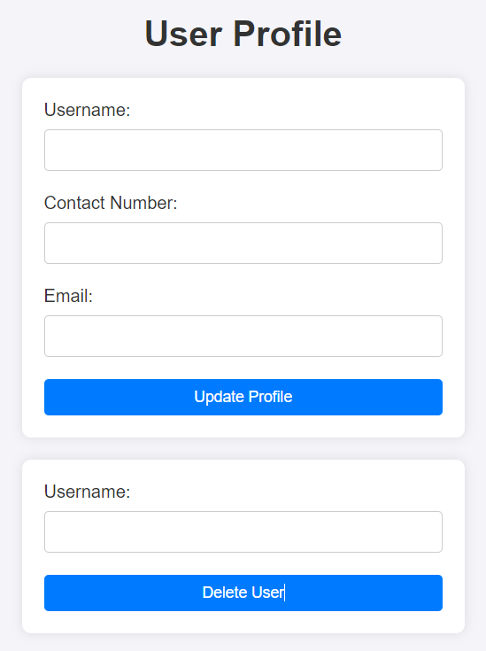

# User Management System

## Overview

Welcome to the User Management System! This system provides a simple and effective way to manage user accounts, with functionalities tailored for both regular users and administrators.

## Features

### 1. **User Authentication**
   - **Login**: Users can securely log in using their username and password. The system differentiates between regular users and administrators based on their `account_type`.
   - **Registration**: New users can easily create an account by clicking the "Register" link on the login page.

### 2. **Role-Based Access Control**
   - The system assigns roles based on `account_type`, determining the level of access each user has.
     - **Regular User**: Access to edit personal information.
     - **Admin**: Access to the admin dashboard, where they can manage other users.

### 3. **Admin Dashboard**
   - **User List**: Admins can view a list of all users, including their email addresses and other relevant information.
   - **Edit Users**: Admins can edit user details, such as username, email, contact number, and account type, by clicking the "Edit" button next to each user.

### 4. **User Profile Management**
   - **Edit Profile**: Users can edit their profile information, such as their username, email, and contact number. Admins have the additional capability to update a user's account type.

## How It Works

- **Login Process**: 
   - Users log in with their credentials.
   - Upon login, the system checks the user's `account_type`.
     - If `account_type` is **user**, they are redirected to their profile edit page.
     - If `account_type` is **admin**, they are redirected to the admin dashboard.

- **Admin Capabilities**:
   - Admins have full control over user management, including the ability to update user information and change account types.

## Getting Started

1. **Clone the Repository**:
   ```bash
   git clone https://github.com/your-repo/user-management-system.git
   cd user-management-system
   ```

2. **Install Dependencies**:
   ```bash
   npm install
   ```

3. **Run the Application**:
   ```bash
   npm start
   ```

4. **Access the Application**:
   - Visit `http://127.0.0.1:5500` in your browser.
   - Login with your credentials or register a new account.

To address the second challenge, here's how I would structure the explanation in the README file:

---

## Understanding the Delete User Functionality: Authentication vs. Authorization

### Introduction

When building secure web applications, it’s crucial to understand the distinct roles that **authentication** and **authorization** play. This section will explore whether the requirement "This delete user functionality can be done after authentication" is a good idea, and clarify why these concepts should not be confused.

### Authentication vs. Authorization

- **Authentication** is the process of verifying the identity of a user. It ensures that the user is who they claim to be by checking their credentials, such as a username and password. In simple terms, it answers the question: "Who are you?"

- **Authorization** occurs after authentication and determines what an authenticated user is allowed to do. It involves checking the user's permissions and roles to decide if they have the right to access specific resources or perform certain actions. This answers the question: "What are you allowed to do?"

### Evaluation of the Requirement

The requirement states that "This delete user functionality can be done after authentication." While authentication is necessary, **relying solely on authentication for a critical operation like deleting a user is not enough**.

#### Why is this a Bad Idea?

- **Insufficient Security**: Authentication only confirms the user’s identity but does not verify their permissions to delete a user. Without proper authorization checks, any authenticated user could potentially delete any other user, which can lead to security vulnerabilities and misuse.

- **Role-Based Access Control (RBAC)**: Typically, deletion of user accounts should be restricted to users with specific roles, such as administrators. This requires an additional authorization check to ensure that only users with the necessary privileges can perform this action.

### How Authentication and Authorization Work Together

Consider the following workflow:

1. **User Authentication**: The system verifies the user's credentials (e.g., username and password). If successful, the user is authenticated.

2. **Authorization Check**: After authentication, the system checks the user's role and permissions to determine if they are allowed to delete a user. For example, only users with an "admin" role should pass this check.

3. **Perform Action**: If the authorization check is passed, the delete action is performed. If not, the user is denied access.

### Diagram: Authentication vs. Authorization in the Delete User Process
```
[User Login Form] --> [Authentication Check (Credentials)] --> [Authorization Check (Role)]
                                                           \
                                                            \--> [Authorized?] --> [Delete User Action]
                                                               \
                                                                \--> [Not Authorized?] --> [Access Denied]
```

*Diagram: The relationship between authentication, authorization, and the delete user functionality.*

### Conclusion

In conclusion, while authentication is essential, it should always be paired with proper authorization checks, especially for sensitive operations like deleting users. Implementing a comprehensive Role-Based Access Control (RBAC) system is a best practice that ensures only authorized users can perform critical actions, maintaining the security and integrity of your application.

---
